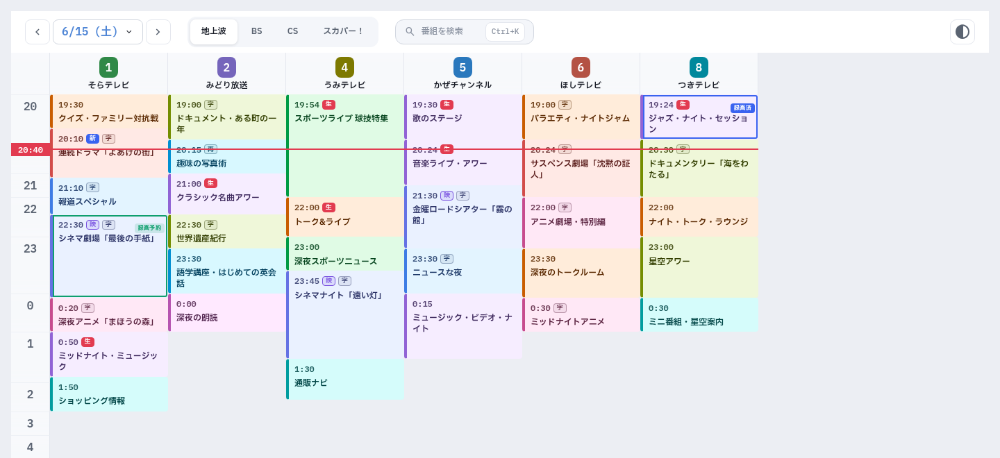
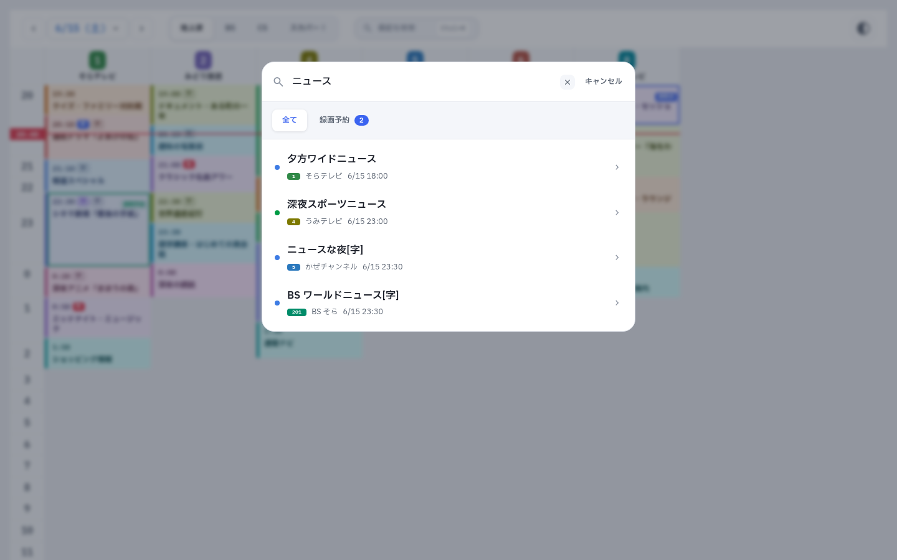
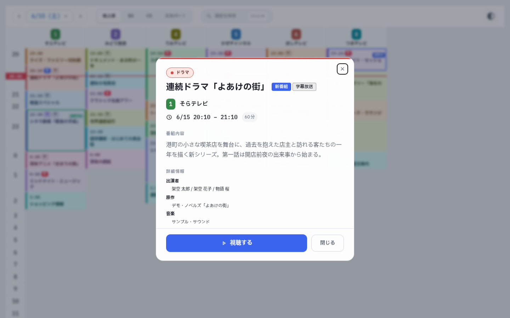
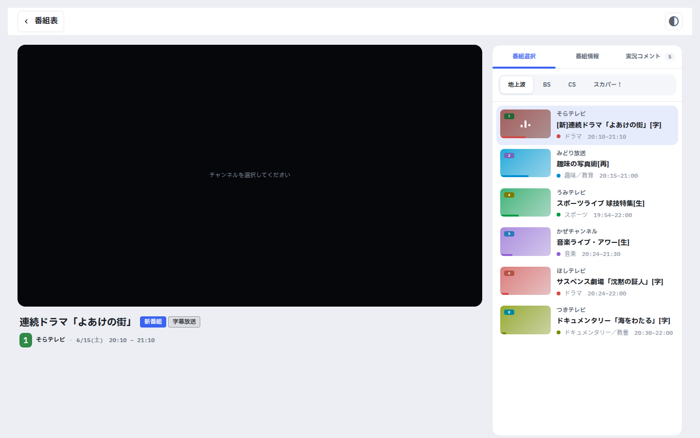

# mirakc-ui

A Web UI for [mirakc](https://github.com/mirakc/mirakc).

Browse the program guide, search programs, schedule recordings, and watch live —
all from your browser.

## Screenshots

> The screenshots use fictional channels and programs; no real broadcast data is
> shown.

<table>
  <tr>
    <td align="center" width="50%">
      <br>
      <sub>Program guide</sub>
    </td>
    <td align="center" width="50%">
      <br>
      <sub>Search</sub>
    </td>
  </tr>
  <tr>
    <td align="center" width="50%">
      <br>
      <sub>Program details &amp; recording reservation</sub>
    </td>
    <td align="center" width="50%">
      <br>
      <sub>Live viewing</sub>
    </td>
  </tr>
</table>

## Features

- Browse the TV program guide per channel type (GR / BS / CS / SKY), with a
  current-time line and genre-coloured cells.
- Search programs by keyword, and review your recording reservations in one
  place.
- Schedule and cancel recording reservations from the program details.
- Watch live in the browser: server-side transcoding to H.264 / AAC, audio
  track and quality switching, ARIB caption overlay, and a live-comment panel.

## Install

First, enable
[mirakc's recording reservation feature](https://mirakc.github.io/dekiru-mirakc/latest/config/recording.html).

Add the following to `docker-compose.yml`.

```yml:docker-compose.yml
services:
  mirakc:
    image: mirakc/mirakc:alpine
    init: true
    restart: unless-stopped
    ports:
      - 40772:40772
    volumes:
      - ./config.yml:/etc/mirakc/config.yml:ro
    environment:
      TZ: Asia/Tokyo
      RUST_LOG: info
## from:
  ui:
    image: ghcr.io/ansanloms/mirakc-ui:latest
    ports:
      - 8888:8000
    volumes:
      - ./mirakc-ui-data:/app/data
    environment:
      MIRAKC_API_URL: http://mirakc:40772/api
## to:
```

mirakc-ui stores its settings (e.g. keyword recording rules) in a SQLite
database under `/app/data`. Mount this directory as shown above so the settings
survive container recreation.

After launching, open <http://localhost:8888/>. It opens the program guide; from
there you can search programs, schedule recordings, and start live viewing.
